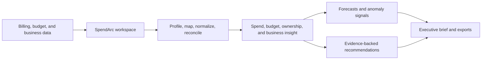

# SpendArc

## Cloud financial intelligence for modern cloud teams

SpendArc helps finance, FinOps, and engineering leaders understand where cloud money is going, what changed, and what deserves attention next.

It brings billing data, budgets, ownership, business context, forecasts, and evidence-backed recommendations into one decision workspace.

**SpendArc** · Cloud FinOps analytics · Local-first reference implementation

> Validate the data. Find the signal. Move with confidence.

[Product capabilities](#what-spendarc-delivers) · [How it works](#how-spendarc-works) · [Technical appendix](#technical-appendix)

## The cloud cost visibility gap

Cloud spend is easy to generate and difficult to explain. Provider exports use different structures, ownership information is often incomplete, and the most important business questions rarely stop at a billing total.

SpendArc is designed for teams that need to answer questions such as:

- Which services, accounts, projects, departments, environments, or regions are driving spend?
- What changed compared with the prior period?
- Are actual costs within budget, and where is risk emerging?
- How much spend can be attributed to an accountable owner?
- What does cloud cost look like relative to customers, revenue, transactions, or usage?
- Which actions are supported by the available evidence?

## What SpendArc delivers

| Product area | Business value |
| --- | --- |
| Trusted cost foundation | Convert provider-specific files into a consistent, reviewable cost model. |
| Spend intelligence | See trends, service drivers, ownership mix, and regional or environmental patterns. |
| Planning and outlook | Compare actuals with budgets and estimate future spend using transparent methods. |
| Cost accountability | Measure allocation and tagging coverage so teams know where ownership is missing. |
| Business context | Relate cloud cost to customers, revenue, transactions, or product usage. |
| Decision-ready communication | Generate concise summaries, recommendations, cleaned data, and executive reports. |

## Built for the people who manage technology economics

**Finance and FP&A** get a clearer view of technology spend, budget variance, and forward-looking cost risk.

**FinOps teams** get a repeatable workflow for ingestion, validation, allocation, trend analysis, anomaly review, and action planning.

**Engineering and platform teams** get service- and ownership-level context without needing to interpret raw billing exports.

**Business and product leaders** can connect infrastructure cost to the outcomes their teams are responsible for delivering.

## How SpendArc works

1. **Bring in the data** — upload a cloud billing export and optionally add budget or business-metric data.
2. **Make the meaning explicit** — review detected columns and confirm the mapping to SpendArc's canonical model.
3. **Trust the numbers** — inspect missing values, duplicates, invalid records, currency consistency, and reconciliation.
4. **Understand the movement** — explore spend by service, account, department, project, environment, and region.
5. **Plan and prioritize** — review budgets, allocation coverage, unit economics, forecasts, anomalies, and supported next steps.
6. **Share the decision** — generate an evidence-backed executive brief and export the supporting data.

## A decision layer built on traceable data



SpendArc keeps the analytical path explainable: source data is profiled and normalized before metrics are calculated, and every summary is grounded in those calculated facts.

## The product experience

### Start with any supported billing export

SpendArc accepts CSV, Excel, and Parquet files, then profiles their structure before analysis begins. Users can review detected dates, services, costs, accounts, regions, departments, projects, environments, usage fields, currencies, and tags.

### See the cost story, not just the total

Interactive views show total spend, average daily spend, period movement, top-service concentration, daily trends, and ranked breakdowns across the dimensions present in the data.

### Connect actuals to operating context

Optional budgets provide actual-versus-budget comparisons. Ownership analysis measures allocation and tagging coverage. Business metrics support cost-per-customer, cost-per-transaction, or other unit-cost views when the data supports them.

### Look forward without hiding uncertainty

SpendArc provides a transparent baseline forecast and historical anomaly detection. Each result includes its method, history, threshold, and caveats so a forecast is not mistaken for certainty.

### Use AI where it adds value

AI helps explain validated results and prioritize follow-up actions. It does not calculate financial values, create unsupported savings claims, or replace the underlying evidence.

## Delivery model

SpendArc is structured as a SaaS-ready product: a clear data contract, modular analytical services, a Streamlit workspace, local persistence, and optional AWS storage and query adapters.

The current reference implementation runs locally and can operate without cloud credentials or an AI API key. The same canonical Parquet model provides a path to S3, Glue, and Athena for a hosted deployment.

## Technical appendix

The sections below are intended for implementation teams and technical stakeholders who want to reproduce or extend the current release.

### Current release

The local MVP covers milestones 0-9. The application works without AWS credentials or an AI key. Optional S3 and Athena adapters are covered by injected-client tests and are not required for local analysis.

### Requirements

- Python 3.11 or newer
- Windows PowerShell, macOS, or Linux shell
- A supported billing file with mappable date, service, and cost columns
- Optional: budget data with period, scope, amount, and currency fields
- Optional: business data with date, metric name, metric value, and unit fields
- Optional: an OpenAI-compatible API key for AI-generated explanations
- Optional: AWS credentials with least-privilege S3 and Athena access

### Detailed data workflow

1. Upload a CSV, Excel, or Parquet billing file.
2. Inspect row counts, columns, inferred types, null rates, distinct values, and sample values.
3. Review and correct semantic mappings.
4. Normalize into the canonical cloud-cost model with source-row lineage.
5. Review blocking errors, warnings, and source-to-canonical reconciliation.
6. Save the run to the local DuckDB warehouse.
7. Apply dashboard filters consistently across KPIs, charts, and tables.
8. Add budget and business-metric files when available.
9. Review forecasts, anomaly evidence, recommendations, and exports.

### Minimum billing fields

The billing source must contain mappable fields for:

- `usage_date`
- `service`
- `cost`

Recommended fields include `currency`, `provider`, `account_id`, `account_name`, `region`, `department`, `project`, `environment`, `resource_id`, `usage_quantity`, `usage_unit`, `usage_type`, `cost_type`, and `tags_json`.

See [docs/DATA_DICTIONARY.md](docs/DATA_DICTIONARY.md) for the canonical schema and accepted upload shapes.

### Data-quality requirements

SpendArc checks for missing required fields, duplicates, invalid dates, invalid costs, unsupported or mixed currencies, blank ownership dimensions, normalization issues, row-count changes, and reconciliation differences. Blocking errors pause analysis; warnings remain visible as caveats.

Metric formulas, denominators, and caveats are documented in [docs/METRIC_DEFINITIONS.md](docs/METRIC_DEFINITIONS.md).

### Quickstart

Run these commands from the SpendArc repository root. Replace the example path with the folder where you cloned the repository.

PowerShell:

```powershell
cd "C:\path\to\spendarc"
python -m venv .venv
.venv\Scripts\Activate.ps1
python -m pip install --upgrade pip
python -m pip install -e ".[dev]"
python data/demo/generate_demo_data.py
python -m streamlit run app.py
```

Upload `data/demo/cloud_billing_demo.csv`, then add `data/demo/budget_demo.csv` and `data/demo/business_metrics_demo.csv` from the optional analysis tabs. The demo data is synthetic and deterministic.

If PowerShell says a command or file cannot be found, check that the prompt is inside the repository folder and that the virtual environment is activated. You can also run the app directly with `.venv\Scripts\python.exe -m streamlit run app.py`.

### Validation and testing

```powershell
python -m pytest -q
python -m ruff check .
python -m compileall -q app.py src tests data/demo
```

GitHub Actions runs tests, linting, and compilation checks on Python 3.11 and 3.12.

### AI guardrails

Python and pandas calculate all financial values before the AI boundary. The AI receives a versioned fact pack containing calculated facts, definitions, quality status, caveats, and recommendation IDs.

The optional provider must return structured JSON. Unsupported fact references or numeric claims cause SpendArc to use the deterministic fallback summary.

### AWS extension

When configured, SpendArc can upload canonical Parquet to S3 under `standardized/cloud_cost/{ingestion_id}.parquet`. `AthenaWarehouse` can run bounded SQL against a Glue/Athena table and return a DataFrame.

See [docs/AWS_ARCHITECTURE.md](docs/AWS_ARCHITECTURE.md) and [infra/aws/README.md](infra/aws/README.md).

### Repository guide

- [docs/PROJECT_PLAN.md](docs/PROJECT_PLAN.md): scope, architecture, milestone gates, and future work.
- [docs/DATA_DICTIONARY.md](docs/DATA_DICTIONARY.md): canonical fields and accepted upload shapes.
- [docs/METRIC_DEFINITIONS.md](docs/METRIC_DEFINITIONS.md): formulas, denominators, and caveats.
- [data/demo/README.md](data/demo/README.md): deterministic demo-data workflow.

### Security and limitations

Use synthetic or anonymized data for development. Do not commit cloud account identifiers, customer data, billing exports, access keys, or `.env` files.

The current release does not claim rightsizing, idle-resource deletion, commitment optimization, multi-currency conversion, or causal explanations without the utilization, pricing, or operational evidence required to support those conclusions.

### Future extensions

Potential next capabilities include hosted multi-user workspaces, scheduled ingestion, provider APIs, resource-utilization evidence, rightsizing analysis, commitment optimization, richer allocation rules, alert delivery, and broader cloud-provider coverage.
