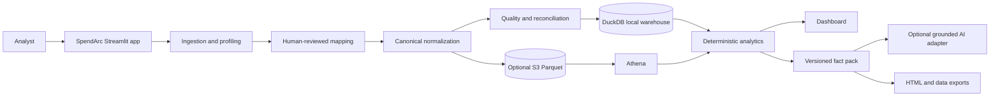

# SpendArc

Cloud FinOps analytics and cost intelligence for finance, engineering, and cloud operations teams.

SpendArc turns messy billing exports into validated spend insights, budget variance analysis, allocation coverage, business unit economics, forecasts, anomalies, and evidence-backed recommendations.

## Current status

The local MVP is complete across milestones 0–9. It works without cloud credentials or an AI key, and the optional S3/Athena adapters are covered by injected-client tests rather than requiring a live AWS account.

## Product promise

> Validate the data, find the signal, and turn cloud cost into a decision.

## Why this project exists

Cloud billing exports are provider-specific, while finance and FinOps teams need consistent answers:

- What changed in cloud spend, when, and which service or owner drove it?
- Are actuals within budget and what is the near-term outlook?
- How much positive spend has an accountable owner?
- How does cloud cost change relative to customers or transactions?
- Which follow-up actions are supported by the available evidence?

SpendArc addresses those questions through a traceable pipeline: profile, map, normalize, validate, calculate, explain, and export.

## Workflow

1. Upload a CSV, Excel, or Parquet billing file.
2. Inspect the source profile and review suggested semantic mappings.
3. Normalize the file into the canonical cloud-cost model with row lineage.
4. Review missingness, duplicates, invalid values, currency consistency, and reconciliation.
5. Explore spend KPIs, daily trends, and dimension breakdowns.
6. Optionally upload budgets and business metrics.
7. Review allocation coverage, cost per unit, forecast, and anomalies.
8. Generate an evidence-backed summary and download the report, fact pack, quality results, and cleaned dataset.

## Architecture



## Core capabilities

- CSV, `.xlsx`, `.xls`, and Parquet ingestion with size/type/error handling.
- Human-reviewed mapping for date, service, cost, account, region, department, project, environment, usage, currency, and tags.
- Canonical normalization with conversion diagnostics and source-row lineage.
- Blocking quality checks and reviewable warnings before analysis.
- Filterable spend KPIs and ranked breakdowns.
- Budget variance, allocation/tagging coverage, and cost per business unit.
- Holt-Winters forecast with a short-history rolling-mean fallback.
- Prior-window median/MAD anomaly detection without look-ahead leakage.
- Conservative recommendations that say “investigate” when billing-only evidence cannot prove savings.
- Fact-grounded deterministic summaries, optional OpenAI-compatible JSON output, and numeric/reference guardrails.
- Cleaned CSV/Parquet, quality JSON, fact-pack JSON, and self-contained executive HTML exports.
- Optional S3 standardized Parquet storage and Athena query adapters.

## Quickstart

PowerShell:

```powershell
python -m venv .venv
.venv\Scripts\Activate.ps1
python -m pip install --upgrade pip
python -m pip install -e ".[dev]"
python data/demo/generate_demo_data.py
streamlit run app.py
```

Upload `data/demo/cloud_billing_demo.csv`, then add the budget and business metric files from the optional analysis tabs. The demo data is synthetic and deterministic.

## Validation

```powershell
python -m pytest -q
python -m ruff check .
python -m compileall -q app.py src tests data/demo
```

GitHub Actions runs the test, lint, and compilation checks on Python 3.11 and 3.12.

## AI guardrail design

Python and pandas calculate all financial values first. The AI boundary receives a versioned fact pack containing calculated facts, definitions, quality status, caveats, and recommendation IDs. The optional provider must return structured JSON; unsupported fact references or numeric claims cause the application to use the deterministic fallback instead.

AI is used for communication and prioritization, not as the source of financial truth.

## AWS extension

The local path is the default. When configured, the application can upload canonical Parquet to S3 under `standardized/cloud_cost/{ingestion_id}.parquet`. `AthenaWarehouse` can run bounded SQL against a Glue/Athena table and return a DataFrame. See [docs/AWS_ARCHITECTURE.md](docs/AWS_ARCHITECTURE.md) and [infra/aws/README.md](infra/aws/README.md).

## Repository guide

- [docs/PROJECT_PLAN.md](docs/PROJECT_PLAN.md): scope, architecture, milestone gates, and future work.
- [docs/DATA_DICTIONARY.md](docs/DATA_DICTIONARY.md): canonical fields and accepted upload shapes.
- [docs/METRIC_DEFINITIONS.md](docs/METRIC_DEFINITIONS.md): formulas, denominators, and caveats.
- [docs/INTERVIEW_NOTES.md](docs/INTERVIEW_NOTES.md): portfolio walkthrough and honest limitations.
- [data/demo/README.md](data/demo/README.md): synthetic demo workflow.

## Privacy and limitations

Use synthetic or anonymized data for development. Do not commit cloud account identifiers, customer data, billing exports, access keys, or `.env` files. SpendArc does not claim rightsizing, idle-resource deletion, commitment optimization, multi-currency conversion, or causal explanations without the evidence required to support those conclusions.
