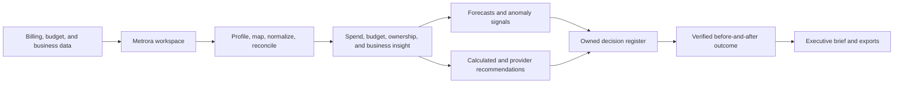
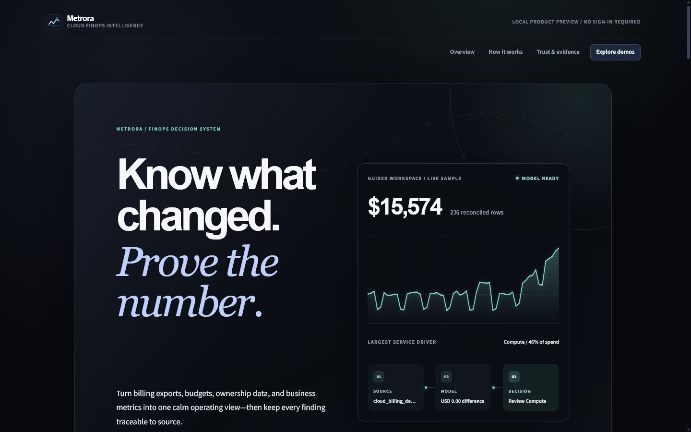
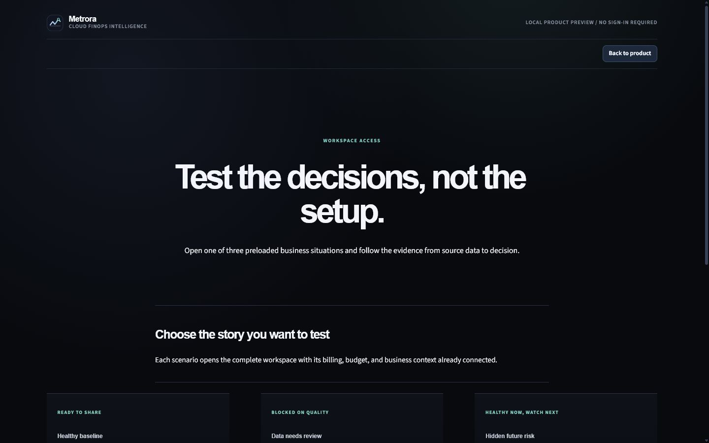
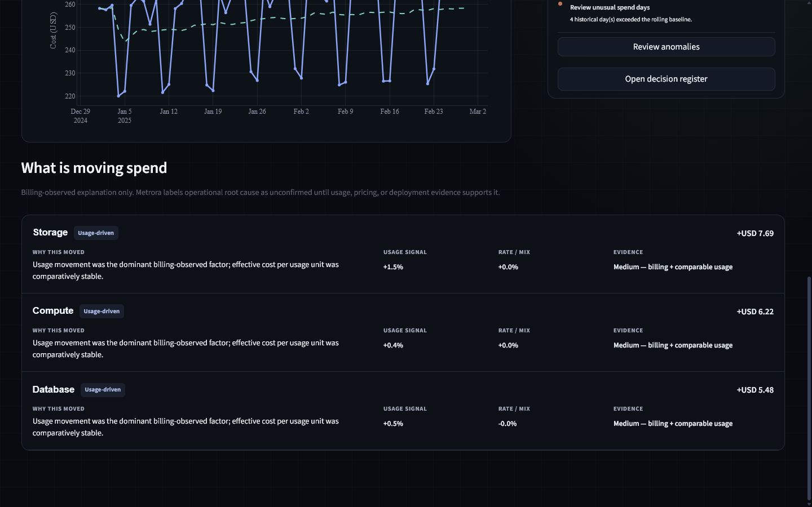

# Metrora

<p align="left">
  
</p>

## Cloud financial intelligence for modern cloud teams

Metrora helps finance, FinOps, and engineering leaders understand where cloud money is going, what changed, who owns the next decision, and whether the result was actually achieved.

It brings provider billing data, native optimization recommendations, budgets, ownership, business context, forecasts, decisions, and verified outcomes into one provider-neutral workspace.

**Live product preview:** [metrora.streamlit.app](https://metrora.streamlit.app/)

**Windows desktop app:** [download the latest portable release](https://github.com/ndomathoti16-create/Metrora/releases/latest)

**Metrora** · Cloud FinOps analytics · Local-first reference implementation

> Validate the data. Find the signal. Move with confidence.

[Product capabilities](#what-metrora-delivers) · [How it works](#how-metrora-works) · [Technical appendix](#technical-appendix)

## The cloud cost visibility gap

Cloud spend is easy to generate and difficult to explain. Provider exports use different structures, ownership information is often incomplete, and the most important business questions rarely stop at a billing total.

Metrora is designed for teams that need to answer questions such as:

- Which services, accounts, projects, departments, environments, or regions are driving spend?
- What changed compared with the prior period?
- Are actual costs within budget, and where is risk emerging?
- How much spend can be attributed to an accountable owner?
- What does cloud cost look like relative to customers, revenue, transactions, or usage?
- Which actions are supported by the available evidence?
- Who accepted, rejected, or implemented each action, and why?
- Did post-change actual cost verify the expected result?

## Why Metrora when cloud providers already have dashboards?

Metrora is not positioned as a replacement for AWS Cloud Intelligence Dashboards, AWS Cost
Optimization Hub, Azure Advisor, or Google Cloud FinOps Hub. Those products have the deepest
provider-specific billing, resource, commitment, and rightsizing data.

Metrora addresses the operating gap after a signal is found: one cross-provider place to
reconcile the evidence, connect it to budgets and business outcomes, assign an owner, record the
decision, preserve rejection reasons, and verify value from comparable before-and-after actuals.
Provider savings remain labeled as estimates until actual billing proves the outcome.

The competitive boundary and roadmap are documented in
[docs/DIFFERENTIATION_STRATEGY.md](docs/DIFFERENTIATION_STRATEGY.md).

## What Metrora delivers

| Product area | Business value |
| --- | --- |
| Trusted cost foundation | Convert provider-specific files into a consistent, reviewable cost model. |
| Automated cloud connections | Refresh scheduled AWS, Azure, or Google Cloud billing exports without storing cloud secrets. |
| Native recommendation intake | Import AWS Cost Optimization Hub findings without changing cloud resources or presenting estimates as realized savings. |
| Spend intelligence | See trends, service drivers, ownership mix, and regional or environmental patterns. |
| Planning and outlook | Compare actuals with budgets and estimate future spend using transparent methods. |
| Cost accountability | Measure allocation and tagging coverage so teams know where ownership is missing. |
| Governance review | Turn trust, allocation, budget, freshness, and business-linkage controls into an actionable policy view. |
| Business context | Relate cloud cost to customers, revenue, transactions, or product usage. |
| Accountable decision register | Track owner, due date, disposition, effort, risk, supporting evidence, and rejection reason. |
| Verified outcomes | Calculate measured cost change only from user-supplied comparable baseline and post-change actuals. |
| Decision-ready communication | Generate concise summaries, recommendations, cleaned data, and executive reports. |

## Built for the people who manage technology economics

**Finance and FP&A** get a clearer view of technology spend, budget variance, and forward-looking cost risk.

**FinOps teams** get a repeatable workflow for ingestion, validation, allocation, trend analysis, anomaly review, and action planning.

**Engineering and platform teams** get service- and ownership-level context without needing to interpret raw billing exports.

**Business and product leaders** can connect infrastructure cost to the outcomes their teams are responsible for delivering.

## How Metrora works

1. **Bring in the data** — upload CSV, Excel, or Parquet, or connect a scheduled AWS, Azure, or Google Cloud billing export.
2. **Let Metrora prepare it** — field detection, mapping, normalization, reconciliation, and quality checks run automatically.
3. **Start with the answer** — Home opens on the current cost position, movement, forecast, anomalies, and attention queue.
4. **Investigate when needed** - Cost explorer supports filtering and driver analysis; Plans & alerts connects forecasts, anomalies, budgets, ownership, and business metrics.
5. **Assign the decision** - calculated signals and imported provider recommendations enter a decision register with an owner, status, due date, effort, risk, and evidence.
6. **Verify the result** - after implementation, compare actual baseline and post-change cost; provider estimates are never counted as realized value.
7. **Review exceptions, not every setting** - manual mapping, reconciliation evidence, and model controls stay under Advanced.
8. **Share the record** - export an evidence-backed brief, decision register, fact pack, quality report, or cleaned dataset.

## A decision layer built on traceable data



Metrora keeps the analytical path explainable: source data is profiled and normalized before metrics are calculated, and every summary is grounded in those calculated facts.

The authenticated workspace is organized as business software rather than a long-form site:

- **Home** — automated operating position and prioritized attention queue.
- **Cost explorer** — date, dimension, and ownership filtering with exact drilldown values.
- **Plans & alerts** — forecast, anomalies, budgets, allocation coverage, and unit economics.
- **Decisions** — prioritized actions, owners, dispositions, native AWS recommendation intake, and verified outcomes.
- **Reports** — executive decision brief and reproducible exports.
- **Data sources** — file uploads, saved cloud connections, sync status, and refresh-on-open.
- **Advanced** — source inspection, mapping corrections, reconciliation, and analytical defaults.

The market and workflow rationale is documented in
[docs/PRODUCT_UX_RESEARCH.md](docs/PRODUCT_UX_RESEARCH.md).

## The product experience

### Product preview

The product opens as one clear, scrolling story: what Metrora does, how its decision path
works, and why each result is trustworthy. The separate demo page then offers three
one-click, deterministic stories in the same workspace used for real files:

<p align="center">
  
</p>

<p align="center">
  
</p>

- **Healthy baseline** shows clean, stable, fully owned spend that is ready to share.
- **Data needs review** contains invalid required values, mixed currency, duplicates, and
  ownership gaps, so Metrora blocks unreliable analysis and explains what must be fixed.
- **Hidden future risk** is reconciled and under its current budget, but its recent run rate
  accelerates enough to create a clear forecast warning and action plan.

<p align="center">
  
</p>

The screenshots above are fresh captures from the current release.

The product and workspace use the original Metrora signal-ribbon mark above rather than a
borrowed asset or stock logo.

### Start with any supported billing export

Metrora accepts CSV, Excel, and Parquet files, then profiles their structure before analysis begins. Users can review detected dates, services, costs, accounts, regions, departments, projects, environments, usage fields, currencies, and tags.

### See the cost story, not just the total

Interactive views show total spend, average daily spend, period movement, top-service concentration, daily trends, and ranked breakdowns across the dimensions present in the data.

### Connect actuals to operating context

Optional budgets provide actual-versus-budget comparisons. Ownership analysis measures allocation and tagging coverage. Business metrics support cost-per-customer, cost-per-transaction, or other unit-cost views when the data supports them.

### Look forward without hiding uncertainty

Metrora provides a transparent baseline forecast and historical anomaly detection. Each result includes its method, history, threshold, and caveats so a forecast is not mistaken for certainty.

### Use AI where it adds value

AI helps explain validated results and prioritize follow-up actions. It does not calculate financial values, create unsupported savings claims, or replace the underlying evidence.

## Delivery model

Metrora is structured as a SaaS-ready product: a clear data contract, modular analytical services, a Streamlit workspace, local persistence, and optional AWS storage and query adapters.

The current reference implementation runs locally and can operate without cloud credentials or an AI API key. The same canonical Parquet model provides a path to S3, Glue, and Athena for a hosted deployment.

## Technical appendix

The sections below are intended for implementation teams and technical stakeholders who want to reproduce or extend the current release.

### Current release

Metrora now has two deliberate surfaces: a hosted product preview with synthetic demo stories,
and a portable Windows application that opens directly into the real analytical workspace.
The desktop release includes secure read-only AWS, Azure, and Google Cloud billing connections,
AWS Cost Optimization Hub recommendation intake, refresh-on-open, local connection history,
governance review, an accountable decision register, actual outcome verification, and the
complete analysis and reporting workflow. File-only analysis still works without cloud
credentials or an AI key.

### Requirements

- Python 3.11 or newer
- Windows PowerShell, macOS, or Linux shell
- A supported billing file with mappable date, service, and cost columns
- Optional: budget data with period, scope, amount, and currency fields
- Optional: business data with date, metric name, metric value, and unit fields
- Optional: an OpenAI-compatible API key for AI-generated explanations
- Optional: AWS credentials with least-privilege S3 and Athena access; Cost Optimization Hub
  import additionally requires `cost-optimization-hub:ListRecommendations`
- Optional: Azure CLI or managed identity with Storage Blob Data Reader access
- Optional: Google Application Default Credentials with BigQuery Job User and Data Viewer access

### Detailed data workflow

1. Upload a CSV, Excel, or Parquet billing file, or connect a provider-managed export under **Data sources**.
2. Metrora profiles, maps, normalizes, reconciles, and quality-checks the source automatically.
3. **Home** opens with the current position and prioritized attention queue.
4. Open **Cost explorer** to change the date range, grouping dimension, or optional filters.
5. Add budget and business-metric files from **Plans & alerts** when available.
6. Open **Advanced** only to replace a source, correct a flagged mapping exception, inspect reconciliation, or tune analytical defaults.
7. Review forecasts, anomaly evidence, allocation coverage, and operating context.
8. Review **Governance** for trust, ownership, budget, freshness, and business-linkage policy status.
9. Open **Decisions** to assign calculated actions, import AWS recommendations, record the
   disposition, or verify an implemented result with actual costs.
10. Open **Reports** for the calculated brief, fact pack, quality report, and cleaned data.
11. Optionally persist the run to DuckDB or configured S3 storage.

### Minimum billing fields

The billing source must contain mappable fields for:

- `usage_date`
- `service`
- `cost`

Recommended fields include `currency`, `provider`, `account_id`, `account_name`, `region`, `department`, `project`, `environment`, `resource_id`, `usage_quantity`, `usage_unit`, `usage_type`, `cost_type`, and `tags_json`.

See [docs/DATA_DICTIONARY.md](docs/DATA_DICTIONARY.md) for the canonical schema and accepted upload shapes.

### Data-quality requirements

Metrora checks for missing required fields, duplicates, invalid dates, invalid costs, unsupported or mixed currencies, blank ownership dimensions, normalization issues, row-count changes, and reconciliation differences. Blocking errors pause analysis; warnings remain visible as caveats.

Metric formulas, denominators, and caveats are documented in [docs/METRIC_DEFINITIONS.md](docs/METRIC_DEFINITIONS.md).

## Try Metrora

### Download the Windows app

Open the [latest Metrora release](https://github.com/ndomathoti16-create/Metrora/releases/latest),
download `Metrora-Windows-x64.zip`, extract the folder, and run `Metrora.exe`. Python is not
required. The app opens directly into a private local workspace and stores its database and
non-secret connection profiles under the current Windows user's local application-data folder.

The Windows package is portable rather than a signed installer. Windows may show a reputation
warning until the executable is code-signed. The source and automated build recipe are included
in this repository for inspection.

To create a release, run the **Windows desktop release** workflow from GitHub Actions for a test
artifact, or push a version tag such as `v0.2.0` to publish the ZIP on the Releases page.

### Hosted preview

Open [metrora.streamlit.app](https://metrora.streamlit.app/) to explore the hosted product
experience. The public preview uses synthetic data only and does not require an account, cloud
credentials, or an API key.

### Run locally

The shortest deployment path is Docker. From the repository root:

```powershell
docker compose up --build
```

Open `http://localhost:8501`. The included health check, production defaults, and persistent
local `data` volume are configured in `compose.yaml`. Stop the service with
`docker compose down`.

For a Python development environment, run these commands from the Metrora repository root.
Replace the example path with the folder where you cloned the repository.

PowerShell:

```powershell
cd "C:\path\to\metrora"
python -m venv .venv
.venv\Scripts\Activate.ps1
python -m pip install --upgrade pip
python -m pip install -e ".[dev]"
python data/demo/generate_demo_data.py
python -m streamlit run app.py
```

The app opens on a single scrolling Metrora product experience. Use **Explore demos** to open
the separate scenario chooser, then select **Healthy baseline**, **Data needs review**, or
**Hidden future risk**. Each option loads its complete billing, budget, and business context in
one click. The local preview uses synthetic data and does not require an account, password,
cloud credentials, or external identity provider.

When using the blank workspace, upload `data/demo/cloud_billing_demo.csv`. Metrora prepares
the cost model and opens **Overview** automatically. Add `data/demo/budget_demo.csv` or
`data/demo/business_metrics_demo.csv` from **Forecast & alerts** when needed. The complete
scenario file list is documented in [data/demo/README.md](data/demo/README.md).

If PowerShell says a command or file cannot be found, check that the prompt is inside the repository folder and that the virtual environment is activated. You can also run the app directly with `.venv\Scripts\python.exe -m streamlit run app.py`.

Metrora uses one deliberate dark visual system across the product page and analytical workspace. This keeps the visual hierarchy, charts, evidence tables, and interactive controls consistent in every view.

### Connect scheduled cloud exports

Install the cloud SDKs when running from source:

```powershell
python -m pip install -e ".[cloud,dev]"
```

- **AWS:** schedule Data Exports or CUR 2.0 to S3, authenticate with AWS SSO or an IAM role,
  then enter the bucket and prefix under **Data sources**.
- **Azure:** schedule a Cost Management ActualCost or AmortizedCost export to Blob Storage,
  run `az login` for local access or use managed identity, then enter the account URL,
  container, and prefix.
- **Google Cloud:** enable Cloud Billing export to BigQuery, run
  `gcloud auth application-default login`, then enter the project, dataset, and table pattern.

Only export locations and identity selectors are saved. Access keys, passwords, tokens, and
service-account files are not stored by Metrora. See
[the productization and security rationale](docs/PRODUCTIZATION_RESEARCH.md) for the permission
model, evidence boundaries, and deferred enterprise controls.

### Validation and testing

```powershell
python -m pytest -q
python -m ruff check .
python -m compileall -q app.py src tests data/demo
```

GitHub Actions runs tests, linting, and compilation checks on Python 3.11 and 3.12.

### AI guardrails

Python and pandas calculate all financial values before the AI boundary. The AI receives a versioned fact pack containing calculated facts, definitions, quality status, caveats, and recommendation IDs.

The optional provider must return structured JSON. Unsupported fact references or numeric claims cause Metrora to use the deterministic fallback summary.

### AWS extension

When configured, Metrora can upload canonical Parquet to S3 under `standardized/cloud_cost/{ingestion_id}.parquet`. `AthenaWarehouse` can run bounded SQL against a Glue/Athena table and return a DataFrame.

See [docs/AWS_ARCHITECTURE.md](docs/AWS_ARCHITECTURE.md) and [infra/aws/README.md](infra/aws/README.md).

### Repository guide

- [docs/PROJECT_PLAN.md](docs/PROJECT_PLAN.md): scope, architecture, milestone gates, and future work.
- [docs/DATA_DICTIONARY.md](docs/DATA_DICTIONARY.md): canonical fields and accepted upload shapes.
- [docs/METRIC_DEFINITIONS.md](docs/METRIC_DEFINITIONS.md): formulas, denominators, and caveats.
- [data/demo/README.md](data/demo/README.md): deterministic demo-data workflow.

### Security and limitations

Use synthetic or anonymized data for development. Do not commit cloud account identifiers, customer data, billing exports, access keys, or `.env` files.

The current release does not claim rightsizing, idle-resource deletion, commitment optimization, multi-currency conversion, or causal explanations without the utilization, pricing, or operational evidence required to support those conclusions.

### Future extensions

Potential next capabilities include hosted multi-user workspaces, scheduled ingestion, provider APIs, resource-utilization evidence, rightsizing analysis, commitment optimization, richer allocation rules, alert delivery, and broader cloud-provider coverage.
