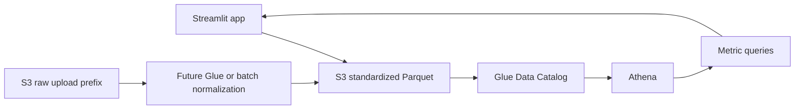

# AWS extension architecture

The local application remains the default demo path. The AWS extension uses the same canonical Parquet shape so a reviewer can understand the cloud path without needing cloud credentials to run the application.



## Storage layout

- `s3://bucket/raw/` stores provider uploads if raw retention is approved.
- `s3://bucket/standardized/cloud_cost/{ingestion_id}.parquet` stores canonical rows.
- `s3://bucket/exports/` stores reviewed report and cleaned-data exports.
- Athena query results use a separate `s3://bucket/athena-results/` prefix.

The `S3Storage` adapter writes canonical DataFrames to Parquet in memory and never stores credentials in the repository. The `AthenaWarehouse` adapter starts a query, polls its state with a timeout, and converts the result set to a DataFrame.

## Configuration

Set these variables only in a local environment or managed secret store:

```text
AWS_REGION=us-east-1
S3_BUCKET=your-finops-bucket
ATHENA_DATABASE=finops
ATHENA_OUTPUT_LOCATION=s3://your-finops-bucket/athena-results/
```

Local DuckDB and the deterministic summary continue to work when these values are empty.

## Security boundary

Use an IAM role or AWS profile with least privilege. The application needs `s3:PutObject`/`s3:GetObject` for approved prefixes and Athena permissions for query execution and result reads. Do not grant broad account administration, commit access keys, or upload real customer billing data to a demo bucket.

## Operational caveats

Athena results are eventually available and incur query cost. Partition standardized data by usage month and provider when volume grows. Keep the local DuckDB path for tests and offline development; use Athena for cloud-scale reporting rather than as a requirement for every local interaction.
