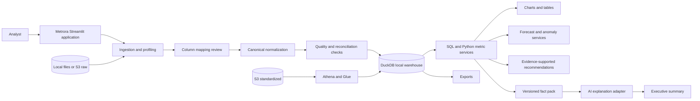

# Metrora

Cloud FinOps analytics and cost intelligence platform.

## Implementation status

Milestones 0–9 are implemented. The local MVP is runnable without AWS credentials or an AI API key; AWS storage/query adapters and the optional AI provider are configured as explicit extensions with deterministic fallbacks and injected-client tests.

## 1. Project definition

### Business problem

Cloud financial data is usually delivered as provider-specific billing exports, while the questions finance and FinOps teams need to answer are business questions:

- What changed in spend, when, and why?
- Which services, accounts, projects, departments, environments, or regions are driving the change?
- Are actual costs within budget, and what will the month end at?
- How much spend is allocated and tagged well enough for ownership?
- What does cloud cost look like relative to customers, revenue, transactions, or product usage?
- Which actions are supported by the available evidence?

The project will solve this by turning heterogeneous cloud billing files and optional business data into a validated, traceable analytical model. It will calculate the financial metrics with Python and SQL, then use AI only to explain those calculated facts in plain language and turn them into appropriately cautious recommendations.

### Product promise

> Upload cloud billing data, validate its meaning, understand the cost drivers, and leave with an evidence-backed operating summary.

The first release is a local Streamlit application. It must work without AWS credentials or an AI API key by using synthetic demo data and deterministic fallback explanations. AWS storage/querying and a hosted AI provider will be integrations, not prerequisites for the local workflow.

### Target user

The primary persona is a junior FinOps, cloud financial analyst, technology finance analyst, or cloud operations analyst who receives billing exports from engineering or a cloud provider and needs to prepare a weekly or monthly review.

Secondary users are a finance manager reviewing budget and forecast risk, and an engineering manager trying to understand ownership and cost drivers.

### Core workflow

1. Upload one billing file and, optionally, a budget file and business-metrics file.
2. Inspect the file profile: row count, columns, inferred types, null rates, distinct counts, sample values, and likely sensitive fields.
3. Review suggested semantic mappings and correct them in the UI.
4. Normalize the source into a canonical cost model.
5. Review data-quality checks and reconciliation totals before analysis.
6. Explore spend over time and by service, account, department, project, environment, and region.
7. Compare actuals with budgets and calculate allocation/tagging coverage.
8. Relate cloud spend to a business metric when one is provided.
9. Review a forecast, anomaly list, and evidence-supported opportunities.
10. Generate an executive summary whose numbers link back to calculated evidence.
11. Export the cleaned dataset and a review-ready report.

## 2. Scope and success criteria

### Minimum viable product

The MVP is a complete vertical slice with deliberately modest depth in each capability:

- CSV, Excel, and Parquet upload.
- File profiling and human-reviewable column mapping.
- Canonical normalization with explicit defaults and conversion errors.
- Data-quality checks for required fields, missingness, duplicates, invalid dates/costs, unsupported currencies, and source-to-canonical reconciliation.
- Local analytical storage in DuckDB, with SQL queries for core metrics.
- Spend trends and ranked breakdowns by the available dimensions.
- Optional monthly budgets with actual-versus-budget variance and forecast-to-budget comparison.
- Allocation and tagging coverage based on mapped ownership dimensions.
- Optional business-metric join and unit-cost calculation, such as cost per customer or cost per transaction.
- A transparent baseline forecast with a fallback for short histories.
- A meaningful-anomaly view based on reproducible statistical rules.
- Evidence-supported recommendations limited to signals present in the data.
- AI-generated explanation from a structured fact pack, with deterministic fallback text.
- Export of canonical data, quality results, metric tables, and an executive report.
- Tests for representative happy paths and failure paths.

### MVP definition of done

The MVP is finished only when a new user can take the included synthetic demo files from upload to exported report without editing code, and when every displayed financial number can be reproduced from the canonical dataset or a documented calculation.

Portfolio acceptance targets:

- Supports at least 100,000 billing rows locally in a normal student laptop workflow.
- Does not silently drop rows during normalization.
- Shows a blocking error when the required date, service, or cost mapping is missing or unusable.
- Shows warnings separately from blocking errors.
- Uses a stable row identifier and source-total reconciliation.
- Produces the same analytical result for repeated runs on the same inputs.
- Runs automated tests and a basic end-to-end smoke test.
- Works with no cloud credentials and no model API key.

### Scope guardrails

The application will not claim to find savings that the input data cannot support. For example, a billing-only file can support a spike, budget, allocation, or trend investigation; it cannot support a definitive instance-rightsizing or resource-deletion recommendation. Those will be worded as investigations unless resource utilization evidence is available.

## 3. Recommended technology stack

### Local application

- Python for ingestion, validation, calculations, orchestration, and tests.
- Streamlit for the portfolio-friendly analytical UI.
- pandas for file interchange and row-level transformations.
- PyArrow for Parquet support and efficient columnar interchange.
- DuckDB for local SQL analytics, reproducibility, and efficient work on Parquet-sized data.
- Plotly for interactive charts.
- Pydantic for configuration and structured facts exchanged between calculation and AI layers.
- pytest for automated tests.
- Ruff for formatting and linting.
- `statsmodels` for a transparent baseline forecast; a rolling or seasonal-naive fallback will cover insufficient history.

`pandera` may be added in the validation milestone if it improves the data-contract implementation. It should not replace readable domain-specific checks.

### Cloud integration after the local MVP

- Amazon S3 for raw uploads, standardized files, and generated exports.
- AWS Glue Data Catalog for table metadata.
- Amazon Athena for serverless SQL over standardized Parquet files.
- boto3 for the narrow S3/Athena integration layer.
- IAM policies with least-privilege access and no credentials committed to the repository.

The application will use storage and query interfaces so that the local backend and the AWS backend share analytical contracts. Local DuckDB remains the default development and demo path.

### AI design

The AI layer will receive a versioned, structured fact pack containing calculated values, time windows, filters, data-quality caveats, and fact identifiers. It will not receive authority to calculate totals. The response will be validated against a schema and checked for unsupported numeric claims. If a provider is unavailable, the application will produce a deterministic summary from the same fact pack.

## 4. High-level architecture



### Logical layers

1. **Presentation**: upload controls, mapping editor, validation report, dashboard tabs, export controls.
2. **Application services**: one use-case function per workflow action; no calculations embedded in Streamlit widgets.
3. **Domain contracts**: canonical schemas, metric definitions, quality statuses, forecast and anomaly result models.
4. **Data engineering**: readers, profiling, semantic mapping, type normalization, currency and date handling, row lineage.
5. **Analytical engine**: DuckDB SQL views plus small Python services for calculations that are easier to test in Python.
6. **Decision intelligence**: forecast, anomaly detection, recommendation rules, fact-pack construction, AI narration.
7. **Persistence and integrations**: local files/DuckDB now; S3/Athena adapters later.

### Data flow and lineage

Every uploaded source receives an `ingestion_id`. Each canonical row retains `ingestion_id`, `source_file`, `source_row_number`, and a deterministic `source_row_hash`. The pipeline records:

- input file metadata and detected format;
- the accepted column mapping;
- normalization warnings and conversion counts;
- quality-check results;
- source total, canonical total, and reconciliation difference;
- filters and date ranges used to produce an analytical result.

This makes the dashboard explainable and allows a reviewer to trace a number back to the source row.

## 5. Canonical data model

### A. Cloud cost fact table: `fact_cloud_cost`

These are the canonical fields. The first three are required for the MVP; the rest are optional but strongly recommended.

| Field | Type | Required | Meaning |
|---|---|---:|---|
| `usage_date` | date | Yes | Date the usage or charge belongs to |
| `service` | string | Yes | Normalized provider service name |
| `cost` | decimal | Yes | Monetary amount used for analysis |
| `currency` | string | No | ISO-like currency code; defaults only when explicitly configured |
| `provider` | string | No | Cloud provider, such as AWS |
| `account_id` | string | No | Provider account or subscription identifier |
| `account_name` | string | No | Human-readable account name |
| `region` | string | No | Cloud region or global scope |
| `department` | string | No | Owning department or cost center |
| `project` | string | No | Product, project, or application |
| `environment` | string | No | Production, staging, development, and similar |
| `resource_id` | string | No | Resource identifier when available |
| `resource_name` | string | No | Human-readable resource name |
| `usage_quantity` | decimal | No | Provider usage quantity |
| `usage_unit` | string | No | Unit associated with usage quantity |
| `usage_type` | string | No | Provider usage category |
| `cost_type` | string | No | Usage, tax, credit, refund, fee, or other |
| `tags_json` | string | No | Original tag payload, preserved for lineage |
| `allocation_status` | string | Derived | `allocated`, `partially_allocated`, or `unallocated` |
| `source_file` | string | Derived | Original file name |
| `source_row_number` | integer | Derived | Original row number |
| `source_row_hash` | string | Derived | Stable row-level lineage key |

The MVP will use the mapped `cost` field as the analysis amount. If both unblended and amortized costs are provided, the UI will require the user to choose one and record that choice in the run metadata.

### B. Budget table: `fact_budget`

Minimum fields: `period_start`, `period_end`, `scope_type`, `scope_value`, `budget_amount`, and `currency`. `scope_type` can be `total`, `account`, `department`, `project`, `environment`, `service`, or `region`. `scope_value` is blank only for `total`.

### C. Business metrics table: `fact_business_metric`

Minimum fields: `metric_date`, `metric_name`, `metric_value`, and `unit`. Optional fields are `dimension_type`, `dimension_value`, and `source`. The MVP will require a user to choose the metric used for unit economics and will not merge unrelated metric grains silently.

### D. Run and quality metadata

`ingestion_run` stores file metadata, accepted mapping, selected cost basis, input totals, output totals, and timestamps. `quality_check_result` stores check name, status, severity, observed value, threshold, and human-readable detail.

### Minimum source file requirements

A billing file must contain mappable date, service, and cost columns. It may use any source names, such as `UsageStartDate`, `ProductName`, `UnblendedCost`, `amount`, or `charge`. The mapping screen is responsible for making the semantic meaning explicit.

The MVP will support common date formats and numeric cost values with thousands separators, currency symbols, and parentheses for negatives. It will reject ambiguous dates and unparseable monetary values rather than guessing.

## 6. Data-quality rules

Checks will be grouped as blocking errors, warnings, and informational results.

### Blocking errors

- Required semantic fields cannot be mapped.
- Dates cannot be parsed within the configured threshold.
- Cost values are not numeric after normalization.
- A required currency decision is missing or multiple currencies are mixed without a conversion policy.
- Canonicalization drops rows or reconciliation exceeds the configured tolerance.

### Warnings

- Missing or blank values in mapped dimensions.
- Exact duplicate rows or repeated source hashes.
- Negative costs, credits, taxes, or refunds requiring interpretation.
- Unrecognized region, environment, or cost-type values.
- Business metrics have dates or grains that do not align with billing data.
- A forecast has too little history or too many missing periods.

### Reconciliation

The pipeline will compare source total and canonical total using the selected cost field. It will show absolute difference, relative difference, row counts, excluded rows, and excluded-value totals. The default tolerance should be small and configurable; it must never hide a difference.

## 7. Repository structure

The project will be created as a new repository with business logic separated from the UI:

```text
metrora/
├── app.py
├── pyproject.toml
├── README.md
├── .env.example
├── .gitignore
├── data/
│   ├── demo/                 # Synthetic, safe-to-share inputs
│   └── README.md
├── docs/
│   ├── PROJECT_PLAN.md
│   ├── DATA_DICTIONARY.md
│   ├── METRIC_DEFINITIONS.md
│   ├── AWS_ARCHITECTURE.md
│   └── INTERVIEW_NOTES.md
├── src/
│   └── finops_cost_intelligence/
│       ├── config.py
│       ├── contracts/
│       ├── ingestion/
│       ├── mapping/
│       ├── normalization/
│       ├── quality/
│       ├── warehouse/
│       ├── analytics/
│       ├── forecasting/
│       ├── anomalies/
│       ├── recommendations/
│       ├── ai/
│       ├── exports/
│       └── ui/
├── tests/
│   ├── fixtures/
│   ├── unit/
│   └── integration/
├── infra/
│   └── aws/                  # Added after local MVP is stable
└── .github/
    └── workflows/
```

`app.py` should only configure the Streamlit page and call application services. Domain calculations must be importable and testable without starting Streamlit.

## 8. Milestones and completion gates

### Milestone 0 — Project foundation

**Build:** new repository metadata, dependency management, configuration, logging, test setup, and a minimal application shell.

**Expected files:** `app.py`, `pyproject.toml`, `.env.example`, `.gitignore`, `src/finops_cost_intelligence/config.py`, package `__init__.py` files, and an initial test configuration.

**Finished when:** the app starts locally, the test runner executes a passing smoke test, configuration works with and without optional secrets, and no credentials or real billing data are tracked.

### Milestone 1 — File ingestion and profiling

**Build:** readers for CSV, Excel, and Parquet; file-size/type checks; a profile object with schema, sample rows, null rates, distinct counts, and parseability signals.

**Expected files:** `ingestion/readers.py`, `ingestion/profile.py`, `contracts/profile.py`, UI upload/profile components, and reader/profile tests.

**Finished when:** all three formats can be loaded from demo fixtures; malformed, empty, oversized, and unsupported files produce useful errors; profiles are deterministic and do not mutate source data.

### Milestone 2 — Semantic mapping and canonical normalization

**Build:** candidate-column detection, mapping review UI, mapping persistence, typed normalization, defaults, and lineage fields.

**Expected files:** `mapping/detector.py`, `mapping/models.py`, `normalization/billing.py`, `contracts/cost.py`, mapping and normalization tests.

**Finished when:** a source with renamed columns can be mapped and normalized; unmapped required fields block the run; ambiguous candidates are shown to the user; numeric/date conversion errors are counted and surfaced; row lineage is present.

### Milestone 3 — Quality checks and local warehouse

**Build:** quality rule engine, reconciliation report, DuckDB schema/load layer, and run metadata.

**Expected files:** `quality/checks.py`, `quality/report.py`, `warehouse/duckdb_store.py`, `warehouse/schema.sql`, `contracts/quality.py`, and integration tests.

**Finished when:** valid data loads into DuckDB; invalid data produces structured results; the source-to-canonical reconciliation is visible; exact duplicate and missingness checks work; a run can be repeated without contaminating prior results.

### Milestone 4 — Core FinOps analytics

**Build:** spend KPI cards, trend analysis, ranked dimension breakdowns, filters, and the first dashboard page.

**Expected files:** `analytics/spend.py`, `analytics/queries.sql`, `contracts/metrics.py`, Plotly chart helpers, dashboard UI modules, and metric tests.

**Finished when:** the same filters apply to headline KPIs and charts; totals tie to the canonical table; dimensions that are not present are clearly marked unavailable; the dashboard is useful with the demo data and remains responsive at the MVP row target.

### Milestone 5 — Budgets, allocation, and business metrics

**Build:** budget ingestion, actual-versus-budget calculations, allocation/tagging coverage, business-metric ingestion, grain validation, and unit economics.

**Expected files:** `normalization/budgets.py`, `normalization/business_metrics.py`, `analytics/budget.py`, `analytics/unit_economics.py`, and related contracts/tests/UI views.

**Finished when:** budget variance distinguishes favorable/unfavorable direction; missing budgets do not appear as zero budgets; coverage denominators are explicit; business metric joins reject incompatible grains and show the selected metric and date range.

### Milestone 6 — Forecasting and anomaly detection

**Build:** baseline monthly forecast, confidence or uncertainty indication, forecast-to-budget comparison, and transparent anomaly rules.

**Expected files:** `forecasting/baseline.py`, `anomalies/detection.py`, `contracts/forecast.py`, `contracts/anomaly.py`, and tests for long, short, missing, flat, and volatile histories.

**Finished when:** forecast method and history are displayed; short history falls back gracefully; anomalies include date, observed value, expected baseline, magnitude, and reason; no model output is presented as certainty; calculations are reproducible.

### Milestone 7 — Recommendations, AI explanation, and exports

**Build:** rule-based opportunity engine, fact-pack builder, provider-agnostic AI adapter, deterministic fallback summary, cleaned-data export, and executive report export.

**Expected files:** `recommendations/rules.py`, `ai/fact_pack.py`, `ai/summarizer.py`, `ai/guardrails.py`, `exports/cleaned.py`, `exports/report.py`, and tests with mocked AI responses.

**Finished when:** recommendations link to facts and label evidence strength; unsupported optimization claims are not emitted; AI failure does not break the dashboard; numeric claims are checked against the fact pack; exports contain the selected filters, period, metric definitions, caveats, and data-quality status.

### Milestone 8 — Portfolio polish and reproducibility

**Build:** demo dataset generator, polished README, screenshots, documentation, test coverage for the main path, CI checks, and a short demo script.

**Expected files:** `data/demo/*`, `data/demo/generate_demo_data.py`, complete README sections, `docs/DATA_DICTIONARY.md`, `docs/METRIC_DEFINITIONS.md`, and GitHub Actions workflow files.

**Finished when:** a reviewer can clone the repo, install dependencies, run one documented command, load demo data, and understand the architecture and limitations without contacting the author.

### Milestone 9 — AWS S3 and Athena extension

**Build:** optional cloud storage/query backend, S3 prefixes, Athena tables/views, deployment notes, and an architecture comparison between local and cloud paths.

**Expected files:** `infra/aws/`, `src/finops_cost_intelligence/storage/s3.py`, `src/finops_cost_intelligence/warehouse/athena.py`, `docs/AWS_ARCHITECTURE.md`, and mocked integration tests.

**Finished when:** the application can upload or read standardized Parquet through S3/Athena using environment configuration; local mode still works; IAM setup is documented; no keys are stored in the repository; cloud integration failures are actionable.

The first seven milestones form the MVP. Milestones 8 and 9 make it portfolio-ready and cloud-relevant after the core workflow is reliable.

## 9. Features to postpone

Postpone these until the MVP is stable:

- Multi-tenant authentication, user roles, and production-grade secrets management.
- Real-time cloud-provider API collection and automatic resource inventory.
- Rightsizing, idle-resource deletion, Savings Plans, Reserved Instances, and commitment optimization.
- Multi-currency conversion and cross-provider normalization beyond the initial contract.
- Complex allocation rule authoring and chargeback journal generation.
- Streaming ingestion, scheduled jobs, email/Slack delivery, and alert management.
- Fully autonomous AI agents or natural-language SQL generation.
- Advanced machine-learning forecasting, causal diagnosis, and probabilistic optimization.
- Kubernetes cost allocation, carbon accounting, and FinOps Open Cost and Usage Specification support.
- Public multi-user hosting and enterprise data-retention controls.

These are valuable future directions, but each adds data, security, or domain complexity that could weaken the reliability of the first release.

## 10. GitHub presentation

The repository should lead with the problem, a short GIF or screenshots of the workflow, the architecture diagram, and a two-minute quickstart. The README should include:

- a one-sentence product description;
- target user and representative questions;
- an architecture diagram;
- supported source formats and canonical schema;
- screenshots of upload/mapping, quality checks, dashboard, forecast, and executive summary;
- a reproducible demo command using synthetic data;
- data-quality and AI guardrails;
- an explicit MVP/future-work boundary;
- testing and validation approach;
- local setup and optional AWS setup;
- a short limitations and privacy section.

Use synthetic data that contains believable patterns such as a deployment spike, an unallocated project, a budget overrun, and a business-metric change. Keep the generator deterministic so screenshots and tests remain stable. Never commit real invoices, account identifiers, access keys, or customer data.

## 11. Interview framing

The strongest interview story is the end-to-end reasoning:

1. A raw billing export is not immediately trustworthy, so the product profiles, maps, normalizes, and reconciles it before analysis.
2. The canonical model separates ingestion from analysis and preserves row-level lineage.
3. DuckDB and SQL provide reproducible calculations locally, while S3/Athena provide a realistic cloud path.
4. Forecast and anomaly methods are intentionally transparent and include data sufficiency caveats.
5. Recommendations are bounded by evidence; the system distinguishes a supported finding from an investigation prompt.
6. AI is used for communication and prioritization after deterministic calculations, not as the source of financial truth.

Be ready to demonstrate one issue from each layer: a mismapped cost column, a reconciliation warning, a service-level driver, a forecast-to-budget risk, and a recommendation that is correctly withheld because the required evidence is absent.

## 12. Implementation protocol

We will implement exactly one milestone at a time. For each milestone, the implementation handoff will contain:

- what is being built and why it matters;
- the files created or changed;
- complete runnable code;
- exact local run and test commands;
- validation and error-handling behavior;
- a completion checklist.

The next milestone will begin only after the current milestone's tests and manual acceptance checks pass. The first implementation step is Milestone 0, and it will establish the clean repository foundation without importing any previous project code or assumptions.
